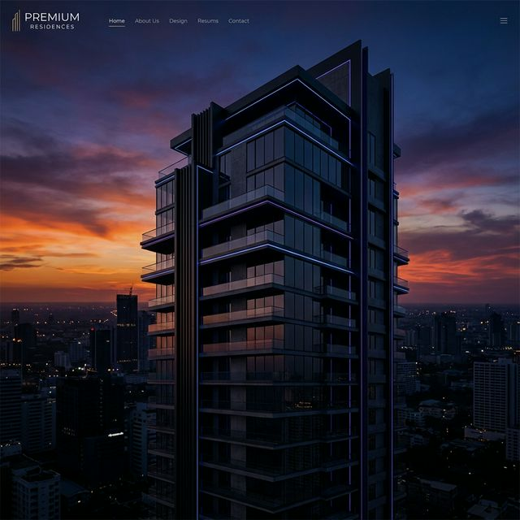

# SRM Stayzo


**SRM Stayzo** is a premium, aesthetic, and highly responsive web platform designed exclusively for students to find flats, share vacancies, and streamline brokerage around SRM University. 

**[Live Demo on Vercel](https://srm-stayzo.vercel.app/)**


---

## 🚀 Features

### 🌟 Premium Aesthetics
- **Modern UI/UX:** Utilizes smooth glassmorphism, gradient accents, and dynamic micro-animations.
- **Responsive Design:** Completely adaptive layout tailored for Mobile, Tablet, and Desktop web views using modern CSS Grid and Flexbox.

### 🏢 Property Listings
- **Featured Flats:** Interactive property cards displaying pricing, location, and BHK configuration.
- **Smart Search:** Mock search bar to filter properties by Location or BHK type.

### 🔐 Multi-Role Authentication
- segregated login flows for **Students** (Find Flats) and **Hosts** (Add Properties).

### 💳 Secure Booking Flow
- Detailed student booking form collecting essential verification documents (Aadhaar, SRM ID).
- **Refundable Token Payment Gateway:** A beautifully mocked UPI/Card payment modal to secure the flat with a ₹5,000 token, refundable if the property doesn't match the listing.

---

## 📸 Screenshots

### Hero Section


### Modern Flat Interior


### Kitchen Aesthetic


---

## 🛠️ Built With
- **HTML5:** Semantic architecture.
- **CSS3:** Native styling without heavy frameworks (Variables, Flexbox, CSS Grid).
- **JavaScript (Vanilla):** DOM manipulation, modal handling, tab-switching, and validation logic.
- **Google Fonts:** Outfit font family for modern typography.
- **FontAwesome:** Scalable vector icons.

---

## 🏃‍♂️ Running Locally

1. Clone the repository:
   ```bash
   git clone https://github.com/varad0225/srm-stayzo.git
   ```
2. Navigate to the project directory:
   ```bash
   cd srm-stayzo
   ```
3. Open `index.html` in any modern web browser or use a local development server (like VS Code Live Server).

---

## 📄 License
This project is licensed under the MIT License - see the [LICENSE](LICENSE) file for details.

---
*Designed with ❤️ for students.*
